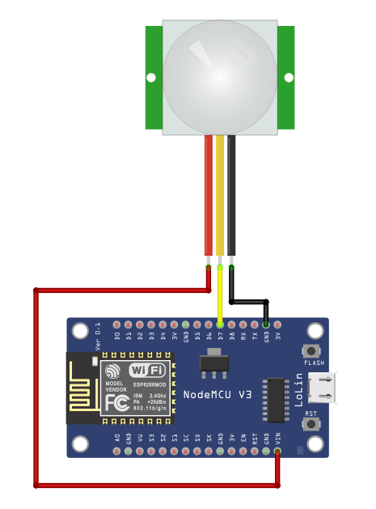
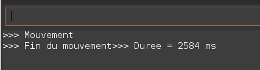
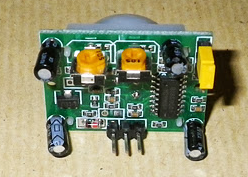

# PIR

Les capteurs PIR (Passive Infra Red) détectent une source d'infra-rouge placée dans son champ de "vision" et détectent ses mouvements. 

Il permettent notamment de détecter une présence humaine ou animale dans un périmètre.

## Branchements

- Vcc sur le Vin de l'ESP
- GND sur le GND de l'ESP
- OUT sur la broche D7

## Résultats

## Photo du capteur

