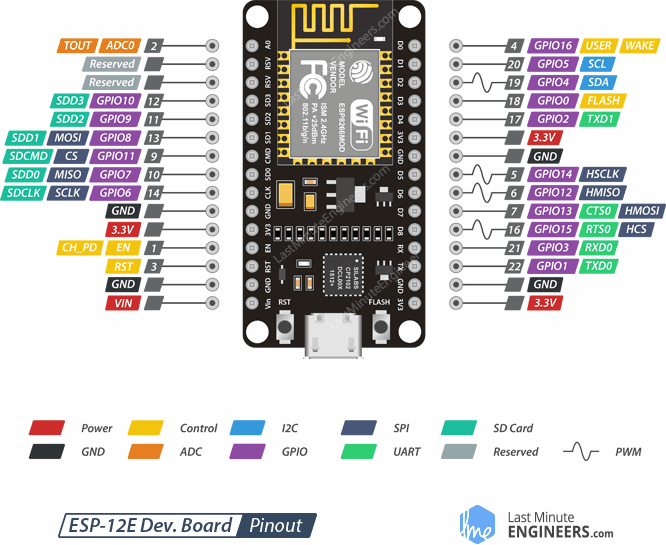

# Codes ESP12

## Sommaire 

- DHT : Un code pour utiliser le capteur de température DHTXX

- HCSR04 : Un code pour le capteur de distance HCSR04

- Moteurs pas à pas : Un code pour la gestion des moteurs pas à pas

- PIR : Un code pour lire un capteur PIR

- Serveurs_Web : Un répertoire pour créer un mini-serveur Web intégrant des capteurs

## Branchement

