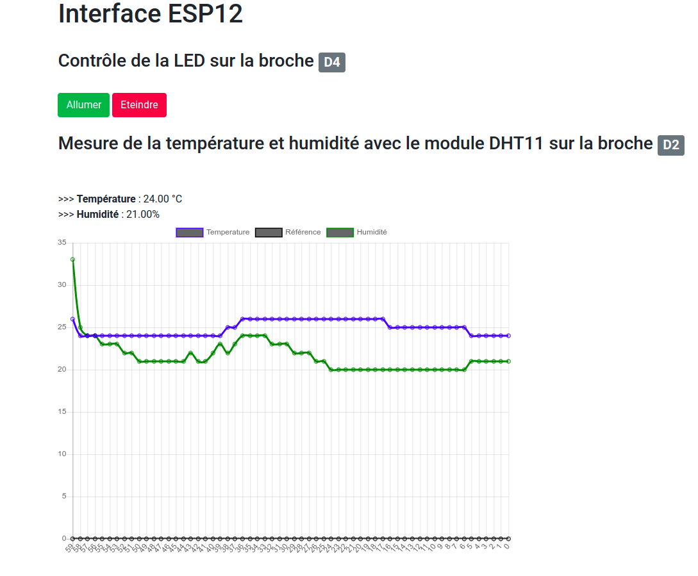

# Code Serveur

Ce code à pour but de créer un mini-serveur avec la carte ESP12 pour afficher la température via un DHT11/22

## Pré-requis

Il faut auparavant vérifier que l'on puisse téléverser du code sur les cartes ESP12. (Voir Section UTILISATION DE L’ESP12 SOUS ARDUINO dans le document PDF [Atelier Réseaux et Serveurs])

## Étapes

- Configurer les paramètres dans le code Arduino et vérifier que le nom du réseau et le mot de passe est le bon (Créafab-Invite dans les locaux, sinon votre nom de box chez vous) et le mot de passe associé : 

```

//########################### Début Paramètres 
#define PORT 80 //Port par défaut
#define LED D4  //Broche de la LED

#define REFRESH_PAGE_DELAY 5 //Temps de reafraichissement de la page en s

#define DHTPIN D2     //Broche du DHT11/22

#define DHTTYPE DHT11   
//#define DHTTYPE DHT22  
//#define DHTTYPE DHT21 

#define NB_DATA_TEMP 60

const char* ssid     = "nom";//Nom du routeur sur le réseau (par Exemple FReebox-44F45)
const char* password = "password"; //Mot de passe du routeur


//###########################Fin paramètres
```
- Téléverser le code Serveur_Web_DHT11_Graph.ino
- Ouvrir le moniteur série et verifier que le module ESP12  se connecte au réseau en affichant son adresse IP

- Saisir son adresse IP dans la barre du haut de votre navigateur.

- L'interface se lance



## Pour aller plus loin

Le module Chart.js a été utilisé pour générer le graphique.
Voic un code HTML minimal pour afficher un graphique. (disponible en lancant ```exemple.html``` depuis un navigateur Internet)

```
<html>  
	<head>    
		
		<title>Serveur Web CREPP</title>    
		<meta charset="utf-8"/>     
		<meta http-equiv="refresh" content="5">    
		<link rel="stylesheet" href="https://stackpath.bootstrapcdn.com/bootstrap/4.3.1/css/bootstrap.min.css" integrity="sha384-ggOyR0iXCbMQv3Xipma34MD+dH/1fQ784/j6cY/iJTQUOhcWr7x9JvoRxT2MZw1T" crossorigin="anonymous">    
		<script src="https://cdnjs.cloudflare.com/ajax/libs/Chart.js/2.5.0/Chart.min.js"></script>      

	</head>  
	
	<body style="margin-left:5%;">    
		
		<h1>Led ESP8266</h1><br>    
		<h3>Contrôle de la LED sur la broche <span class="badge badge-secondary">D4</span></h3><br>      
		
		<a href="/?LED=ON"><button class="btn btn-success">Allumer</button></a>      
		<a href="/?LED=OFF"><button class="btn btn-danger">Eteindre</button></a><br><br>    
		
		<h3>Mesure de la température et humidité avec le module DHT11 sur la broche <span class="badge badge-secondary">D2</span></h3><br>      
		
		>>> <b>Température</b> : 34.00 °C<br>      
		>>> <b>Humidité</b> : 16.00%      
		
		<div style="max-width:50%;">
			<canvas id="myChart" width="200" height="100"></canvas>   
		</div>
		
		<script>    
			var ctx = document.getElementById('myChart'); 
			var values = [21, 22, 22, 21, 22];
			var time = [4,3,2,1,0];
			var myChart = new Chart(ctx, { type: 'line', data: { labels: time, datasets: [{ label: 'Temperature', data: values }], }});
		</script>  
	
	</body></html>
    ```

