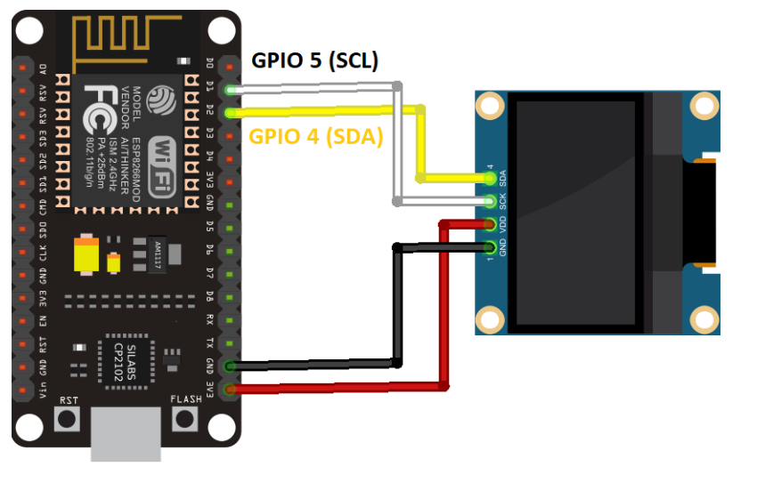

# Code Serveur Web avec OLED

Ce code à pour but de créer un mini-serveur avec la carte ESP12 pour allumer la LED interne de la carte via un navigateur.
L'adresse IP du serveur est affichée sur un écran OLED dont voici le branchement :

## Pré-requis

Il faut auparavant vérifier que l'on puisse téléverser du code sur les cartes ESP12. (Voir Section UTILISATION DE L’ESP12 SOUS ARDUINO dans le document PDF [Atelier Réseaux et Serveurs])

## Étapes

- Téléverser le code Serveur_Web_OLED.ino et vérifier que le nom du réseau et le mot de passe est le bon (Créafab-Invite dans les locaux, sinon votre nom de box chez vous) et le mot de passe associé.

- Ouvrir le moniteur série et verifier que le module ESP12  se connecte au réseau en affichant son adresse IP.

Le cas échant, faite un reset de la carte en appuyant sur le bouton RST de la carte.

  L'écran OLED doit afficher le nom du réseau et l'adresse IP.

- Saisir son adresse IP dans la barre du haut de votre navigateur.

- L'interface se lance, vous pouvez allumer ou éteindre la LED.

